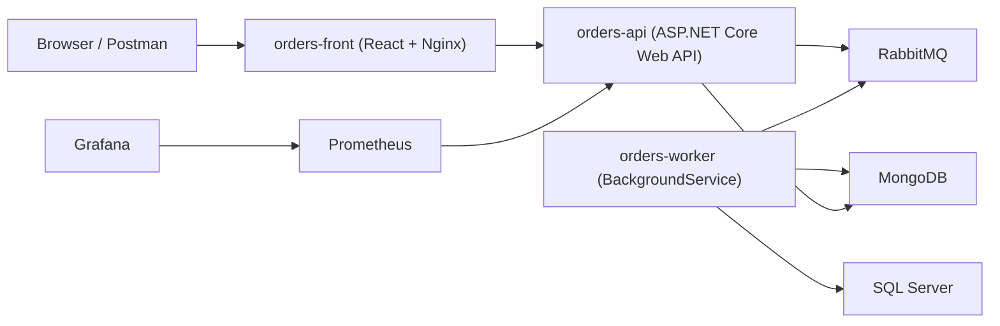

# Arquitetura — Orders (API + RabbitMQ + Worker)

## Visão (C4 — Containers)

```mermaid
flowchart LR
  Client["Browser / Postman"] --> Front["orders-front (React + Nginx)"];
  Front --> ApiSvc["orders-api (ASP.NET Core Web API)"];

  ApiSvc --> MQ["RabbitMQ"];
  WorkerSvc["orders-worker (BackgroundService)"] --> MQ;

  WorkerSvc --> SQL["SQL Server"];
  WorkerSvc --> MongoDb["MongoDB"];

  ApiSvc --> MongoDb;

  Prometheus["Prometheus"] --> ApiSvc;
  Grafana["Grafana"] --> Prometheus;
```

