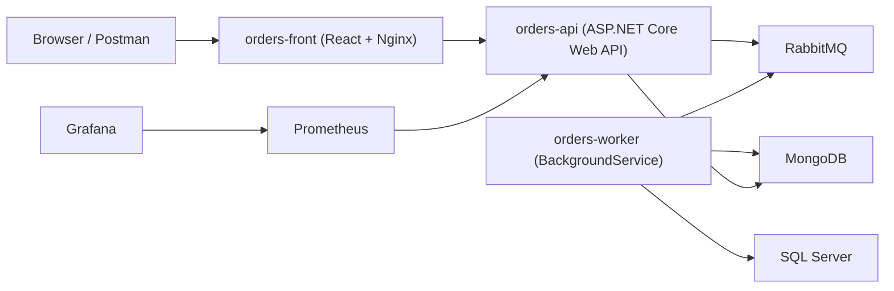
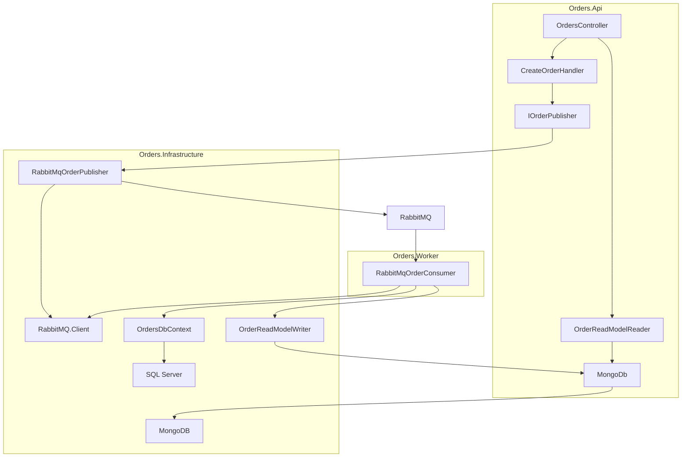

# Arquitetura — Orders (API + RabbitMQ + Worker)

## Visão (C4 — Containers)

```mermaid
flowchart LR
  Client["Browser / Postman"] --> Front["orders-front (React + Nginx)"];
  Front --> ApiSvc["orders-api (ASP.NET Core Web API)"];

  ApiSvc --> MQ["RabbitMQ"];
  WorkerSvc["orders-worker (BackgroundService)"] --> MQ;

  WorkerSvc --> SQL["SQL Server"];
  WorkerSvc --> MongoDb["MongoDB"];

  ApiSvc --> MongoDb;

  Prometheus["Prometheus"] --> ApiSvc;
  Grafana["Grafana"] --> Prometheus;
```

## Visão (C4 — Components / Code)

```mermaid
flowchart TB
  subgraph Api["Orders.Api"]
    Controller["OrdersController"] --> Handler["CreateOrderHandler"];
    Handler --> PublisherPort["IOrderPublisher"];
    Controller --> Reader["OrderReadModelReader"];
    Reader --> MongoClient["MongoDb"];
  end;

  subgraph Infra["Orders.Infrastructure"]
    RabbitPublisher["RabbitMqOrderPublisher"] --> RabbitClient["RabbitMQ.Client"];
    EfContext["OrdersDbContext"] --> SqlServer["SQL Server"];
    MongoWriter["OrderReadModelWriter"] --> MongoClient;
    MongoClient --> MongoDb["MongoDB"];
  end;

  subgraph Worker["Orders.Worker"]
    Consumer["RabbitMqOrderConsumer"] --> EfContext;
    Consumer --> MongoWriter;
    Consumer --> RabbitClient;
  end;

  PublisherPort --> RabbitPublisher;
  RabbitPublisher --> MQ["RabbitMQ"];
  MQ --> Consumer;
```